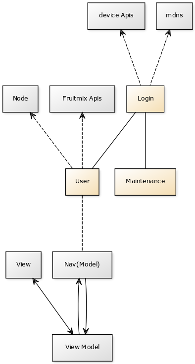

**copyright 上海闻上科技 (wisnuc) 2014-2017**

___

# Fruitmix-Desktop 软件说明

**作者**

* 刘华 李新炜

**版本**

* 2017-5-3 草稿（刘华）
* 2017-5-31 添加设计逻辑和源码详解（李新炜）

**目录**

[TOC]

## 使用说明

### 安装依赖

* 安装nodejs ，webpack
* 安装 项目依赖包 ，运行npm install

### 常用操作及命令

* 打包前端代码 : webpack
* 打包前端代码 (开发环境) : webpack --watch
* 打包后端代码 : npm run build
* 运行项目(开发环境) : npm run devel
* 清除热替换产生的缓存 : grunt clean

## 项目结构

* dbCache : 数据库文件存放目录

* doc : 项目文档目录

* media : 缩略图 原图存放目录

* node : 后端源代码目录

	* lib : electron 相关模块
	* serve : electron redux存放目录（store, action, reducers）

* node_modules : 存放项目依赖包（工具相关）

* public :  前端资源文件目录

	* assets : 存放资源文件（css, images, font)
	* bundle.js : 前端打包输出

* src : 前端源代码目录

	* app
		* action : redux相关action
		* components : react组件
		* lib : 组件相关依赖
		* reducers : redux 相关 reducer
		* stores : 创建redux store
		* utils : 各类封装的function
		* app.js : js入口, 定义debug关键字 , 调用fruitmix.js
		* fruitmix.js : 挂载组件, 事件监听
	* assets : 组件相关样式、图片 
	* index.html : 前端页面入口

* test: 模块单元测试目录

* .babelrc : babel工具配置文件

* devel.js :  开发环境使用的入口文件

* Gruntfile.js :  grunt 配置文件 [详细说明](https://gruntjs.com/sample-gruntfile)

* package.json : 配置项目依赖及命令 [详细说明](https://docs.npmjs.com/files/package.json)

* webpack.config.js : webpack配置文件 [详细说明](https://webpack.js.org/concepts/)

## 前端架构设计

* UML 

* components

	* Login: 用户登录界面
	
	* Maintenance: 维护模式页面
	
	* User: 用户登录成功后的使用界面。该部分采用MVVM的架构，即Model-View-ViewModel，View绑定到ViewModel，通过ViewModel来控制View。ViewModel跟Model通讯，告诉它更新来响应UI。

		* Model: 管理api，分发数据

		* ViewModel: 处理单个View所需要的数据与操作

		* View: 呈现具体的用户界面

* interface

	* mdns: 搜索局域网内的设备信息，如ip，用户列表等

	* device api: 包括3000端口system部分api，及3721端口与登录或应用初始化相关的api

	* fruitmix api: 3721端口的api，如File APIs、Media APIs等

	* node: 通过ipcRenderer与node通讯，获取本地文件，如file、media等

## 前端业务逻辑

主要包括三部分的页面，即Login、Maintenance、User页面。

### Login

默认启动时会进入login页面。此时系统会进行搜素设备的过程。用户可以在搜索到的不同设备间切换选择。设备可以有多种状态，包括：

* 未初始化：第一次启动的设备会显示为未初始化，可进入初始化界面，选择磁盘并建立账户和设置密码

* 正常启动：正常的状态，可以选择特定用户，输入正确密码后登录进应用，页面切换为user页面

* 以维护模式启动：用户可点击进入维护模式，页面切换为Maintenance页面

* 设备已搜索到，但出现错误：目前只能等待或重启

* 自动登陆：自动登陆上次登陆的设备，功能尚未实现

### Maintenance

维护模式页面，主要显示当前设备的磁盘阵列信息及其他磁盘信息，可进行新建磁盘阵列、启动应用、安装/重新安装应用、回到login页面等操作

* 新建磁盘阵列: 选择磁盘建立磁盘阵列用于安装wisnuc，可以选择single、raid0、raid1等多种模式，该操作会格式化磁盘为Btrfs文件系统

* 启动应用: 当应用已安装且没有检测到错误时，会显示启动应用的按钮，启动成功后可回到login页面进行登录

* 安装/重新安装应用: 对于文件系统格式为Btrfs的磁盘，可进行安装wisnuc。对于已安装wisnuc的磁盘可重新安装（目前禁用）

* 回到login页面: 页面切换到login页面

### User

用户使用界面组成包括AppBar、QuickNav、content、Detail、NavDrawer、snackBar等

**AppBar**

顶部菜单栏和工具栏

**NavDrawer**

左侧导航菜单栏，包括顶部的avatar、用户名、设备序列号、各个导航菜单及退出按钮。

**QuickNav**

快速导航栏，包括当前group的所有页面导航，但group内仅一个页面时不显示

**Detail**

右侧可弹出的detail页面

**snackBar**
	
全局消息显示，主要是与服务器通讯后的成功或失败信息

**content**

主要内容页面，可以是以下页面之一，默认为`我的文件`页面

* file: 文件部分，包括

	* 我的文件
	* 共享文件夹
	* 物理磁盘
	* 文件传输

* media: 媒体部分，包括

	* 我的照片
	
* settings: admin用户的管理页面，普通用户该部分不展示

	* 用户管理
	* 共享文件夹管理
	* 设备信息
	* 网络设置
	* 时间与日期
	* 重启和关机
	
* others: 其他页面，包括
	
	* 我的账户

## 前端源码详解（src/app/）

### app.js

app.js 引入了真正的入口文件fruitmix.js，定义调试模块（debug）的输出结果

### fruitmix.js

fruitmix负责初始化页面、引入样式、挂载react根组件以及一些初始化工作，调用main.jsx

### main.jsx

顶层React页面，根据当前状态选择渲染login、Maintenance或Navigation页面。主要函数包括：

* setPalette: 定义字体、primary color、accent color
* selectDevice: 选择设备并加载设备信息，调用./components/common/device
* nav: 跳转页面
* maintain: 跳转至maintenance页面
* login: 跳转至Navigation页面，即登陆成功后的页面

### component

#### login

登陆页面

* Login.jsx: 登陆页面的入口，搭建整体页面

* CrossNavcd.jsx: 处理切换设备时的动画

* InfoCard.jsx: 渲染尚未发现设备时的等待页面

* ErrorBox.jsx: 渲染系统错误信息

* ModelNameCard.jsx: 设备信息界面，包括设备图标、名称、序列号等

* Barcelona.jsx: ws215i的logo

* Computer.jsx: 计算机logo

* HoverNav.jsx: 左右切换的按钮

* UserBox.jsx: 渲染罗列用户的Box

* LoginBox.jsx: 渲染登录框，包括输入密码等操作

* InitStep.jsx: 初始化页面，调用UsernamePassword和CreatingVolumeDiskSelection

* UsernamePassword.jsx: 输入用户名、密码的对话框

* CreatingVolumeDiskSelection.jsx: 创建磁盘阵列的信息框

#### nav

页面框架及数据分发，亦即model部分

* Navigation.jsx: 渲染用户登入系统后的页面框架，根据view model 中各函数返回值渲染页面，包括

	* AppBar: 渲染顶部菜单栏和工具栏
	* QuickNav: 渲染左侧快速导航栏，调用QuickNav.jsx
	* content: 渲染主要内容的部分，调用view.renderContent
	* Detail: 右侧可弹出的detail页面，由view.renderDetail渲染
	* NavDrawer: 左侧导航菜单栏，调用NavDrawer.jsx
	* snackBar: 全局消息显示，主要是与服务器通讯后的成功或失败信息

* NavDrawer.jsx: 渲染左边菜单栏，包括顶部的avatar、用户名、设备序列号及各个导航菜单。主要函数和组件有：
	
	* class MenuItem: 渲染每个导航菜单的基本组件
	* class SubHeader: 渲染小标题
	* function renderGroup： 渲染一组导航菜单，目前包括file、media、settings

* QuickNav.jsx: 渲染快速导航栏

#### view

ViewModel 部分

* Base.jsx: 所有model的基类，注意该组件非react组件，定义一些基本的函数，包括：
	
	* setState: 更新状态的函数，更新时会emit 'update' 信息，由Navigation.jsx接收，触发重新刷新
	* willReceiveProps: 接受Navigation.jsx传递的props，可对props处理，更新state等
	* navEnter: 处理载入页面前的活动
	* navLeave: 处理页面将要离开时的活动
	* navGroup: 定义页面的group，包括file、media、settings、other等
	* groupPrimaryColor: 定义页面group的整体PrimaryColor
	* groupAccentColor: 定义页面group的整体AccentColor
	* menuName: 定义显示的菜单名称
	* menuIcon: 定义显示的图标
	* quickName: 定义快速导航栏显示的菜单名称
	* quickIcon:定义快速导航栏显示的图标
	* appBarStyle: 定义appBar的样式，包括light、colored等
	* appBarColor: 定义appBar的颜色
	* primaryColor:定义PrimaryColor
	* accentColor:定义AccentColor
	* prominent: 定义Header的高度，prominent为true时高度为128，反之为64
	* showQuickNav: 定义是否显示快速导航栏
	* hasDetail: 定义是否有detail页面
	* detailEnabled: detail页面是否可以打开
	* detailWidth: 定义detail页面的宽度
	* renderTitle: 渲染页面的主标题
	* renderNavigationMenu: 渲染导航按钮
	* renderToolBar: 渲染工具栏
	* renderSnackBar: 渲染SnackBar，用于返回信息
	* renderDetail: 渲染detail页面
	* renderContent: 渲染主要的内容页面
	
* Home.jsx: 首页，也是我的文件页面

* Public.jsx: 共享文件夹

* Physical.jsx: 物理磁盘

* Transmission.jsx: 文件传输

* Media.jsx: 我的照片，处理与传递media的metadata，调用photo/PhotoApp。主要的函数包括
	
	* memoize: 暂存处理后的photoInfo、浏览位置等数据
	* photoInfo: 对metadate进行处理，计算整个列表的结构、长度等参数，返回给PhotoList
	* timeline: 根据当前列表的内容，计算对应的时间轴上各时间的位置

* Account.jsx: 个人账户管理，传递与更新account信息，调用control/AccountApp

* AdminUsers.jsx: 用户管理，传递与更新adminUsers信息，调用control/AdminUsersApp

* AdminDrives.jsx: 共享盘管理，传递与更新adminDrives与adminUsers信息，对右键菜单的控制也在这里。调用组件包括：
	
	* control/AdminDriversApp: 显示共享盘列表
	* control/DriversDetail: 显示共享文件盘详细内容，并提供修改功能

* Device.jsx: 设备信息，传递与更新device信息，调用control/DeviceInfo

* Networking.jsx: 网络管理，传递与更新net信息，调用control/NetworkInfo

* TimeDate.jsx: 时间与日期，传递与更新timedate信息，调用control/TimeDateInfo

* FanControl.jsx: 风扇状态与调节，传递与更新fan信息，调用control/Fan

* Power.jsx: 电源管理，传递api，调用control/PowerApp
* FileSharedWithMe.jsx
* FileSharedWithOthers.jsx
* MediaAlbum.jsx
* MediaShare.jsx
* Storage.jsx

#### file

文件相关页面

* FileDetai.jsx: 文件详细信息，包括三部分:
	
	* header: 标题，目前是icon+文件名
	* picture: 缩略图，仅含有metadata的图片文件会展示缩略图
	* data: 信息列表，由renderList渲染，包括类型、大小、位置、修改时间，图片则会加上拍摄时间、拍摄设备、分辨率等信息
	
* ...

#### photo

照片相关页面

* PhotoApp.jsx: 照片的入口，搭建整体页面，包括: 
	
	* PhotoList: 渲染照片列表，调用PhotoList.jsx
	* Carousel: 轮播页面，目前未使用
	* PhotoDetail: 照片详细页面，调用PhotoDetail.jsx
	* Media Upload: 上传照片组件，目前未使用
	
* PhotoList.jsx: 渲染照片列表与时间轴，照片列表使用react-virtualized来渲染，数据来源于Media.jsx:photoInfo的结果，调用RenderListByRow。时间轴部分包括了date list、position bar、BarFollowMouse、DateBox等部分。主要函数包括：
	
	* showDateBar: 显示或隐藏时间轴
	* onScroll: 处理滚动条滚动时的行为，包括计算当前页面对应的日期、页面在时间轴对应位置、显示时间轴等
	* onMouseMove: 处理鼠标移动到时间轴上后的行为，包括改变鼠标图标、选择和跳转页面等
	* renderTimeline: 渲染时间轴组件，调用来自media.jsx:timeline计算的数据，目前使用物理对应的方式计算时间轴上个日期的间隔

* RenderListByRow.jsx: 渲染图片列表的一行，多加这一层主要用于在滚动条滑动时避免重新渲染，调用PhotoItem组件

* PhotoItem.jsx: 渲染一张图片的基本组件，加载时通过ipcRenderer与node通讯获取图片，通讯信息包括

	* mediaShowThumb，发送需要获取的图片的请求
	* mediaHideThumb，取消请求
	* getThumbSuccess，接受成功获取的图片路径

* PhotoDetail.jsx: 渲染图片详细页面，首先加载缩略图，然后加载原图，目前使用ReactTransitionGroup和TweenMax做入场与变化的动画。

	* class PhotoDetail: 对PhotoDetailInline包裹ReactTransitionGroup和RenderToLayer。前者是做入场与变化的动画的需要，后者是将页面提到页面的顶层。
	* class PhotoDetailInline: 主要的渲染组件，渲染了大图（main image）、左右及返回按钮（left Button、right Button、return Button）、遮罩层（overlay）
	* function requestNext: 请求下一张照片的缩略图，记忆当前图片位置
	* function changeIndex: 判断并确定当前照片的index
	* function updatePath: 更新大图
	* function updateThumbPath: 更新缩略图
	* function calcPositon: 计算鼠标位置，根据位置显示或隐藏按钮
	* function calcSize: 根据metadata和页面大小，计算图片应该显示的长度与高度
	* function animation: 添加动画，配合componentWillEnter、componentWillAppear、componentWillLeave等函数使用
	* function handleKeyUp: 处理按键，使用方向键控制选择上一张或下一张图片
	* function renderDetail: 渲染大图的组件，引入EventListener监听按键，由this.state.thumbPath或detailPath控制渲染ThumbImage和DetailImage

#### control

用户及设备设置页面

* AccountApp.jsx: 账户设置页面，包括以下部分
	
	* avatar: 展示头像，目前是固定的icon
	* username及usertype，显示当前用户名及用户类型
	* change username: 修改用户名，调用ChangeAccountDialog
	* change password: 修改密码，调用ChangeAccountDialog

* AdminUsersApp.jsx: 显示当前用户列表，创建新用户，包括以下部分
	
	* FloatingActionButton & ChangeAccountDialog，创建新用户，调用ChangeAccountDialog.jsx
	* renderUserRow: 渲染用户列表
	
* ChangeAccountDialog.jsx: 输入和修改用户名、密码的dialog。主要函数包括：

	* fire: 发送创建账户/修改用户名或密码的请求，处理反馈信息
	* updateUsername: 判断用户名是否符合要求
	* updatePassword: 判断密码是否符合要求
	* updatePasswordAgain: 判断再次输入的密码是否符合要求
	* inputOK: 判断总体输入是否合法

* AdminDriversApp.jsx: 显示当前共享盘，创建新共享盘，包括以下部分

	* FloatingActionButton & NewDriveDialog: 创建新共享盘，调用NewDriveDialog.jsx
	* DriveHeader: 渲染列表的标题栏
	* DriveRow: 渲染列表内容

* DriversDetail.jsx: 显示共享文件盘详细内容，并提供修改功能，主要函数包括：
	
	* fire: 发送修改共享盘名称或用户权限的请求，处理反馈信息
	* updateLabel: 判断共享盘名称是否符合要求
	* togglecheckAll & handleCheck: 处理选择操作
	
* NewDriveDialog.jsx: 添加新共享盘的dialog，结构上与DriversDetail的类似

* Fan.jsx: 渲染设备风扇的信息，包括马达动力和转速，并提供修改马达动力的功能，主要函数包括：
	
	* setFanScale: 发送调节马达动力请求
	* increment & decrement: 增减马达动力
	
* PowerApp.jsx: 渲染电源控制，包括关机、重启、重启并进入维护模式三种操作，主要函数包括：
	
	* boot: 发送关机或重启的请求，并传递反馈信息至snackbar
	* handleOpen & handleClose 处理打开和关闭确认提示对话框的操作
	* handleStartProgress & handleEndProgress & handleExit 处理打开或退出等待关机/重启页面的页面
	* scanMdns: 通过反复搜索mdns来判断关机/重启状态
	
* NetworkInfo.jsx: 渲染网络信息，包括网卡名称、地址类型、网络地址、子网掩码、MAC地址等
	
* DeviceInfo.jsx: 渲染设备信息，包括硬件类型、CPU、内存等

* TimeDateInfo.jsx: 渲染日期和时间信息

#### maintenance

维护模式

* Maintenance.jsx: 维护模式的入口，搭建整体页面，调用BtrfsVolume、NewVolumeTop、PartitionedDisk、FileSystemUsageDisk、
NoUsageDisk、RenderTitle等组件。主要的函数包括：

	* reloadBootStorage： 调用props.selectedDevice.refreshSystemState 来刷新storage、boot信息，重置创建新磁盘阵列页面。
	* renderBootStatus： 当设备已经启动时，显示ip、model、serial等信息并隐藏创建新磁盘阵列的按钮

* BtrfsVolume.jsx: 渲染格式为Btrfs的磁盘内容，包括了：
	
	* startWisnucOnVolume: 启动wisnuc应用
	* renderFinished: 启动过程反馈页面
	* VolumeWisnucError: 调用VolumeWisnucError.jsx，渲染wisnuc的错误信息
	* InitVolumeDialogs: 调用InitVolumeDialogs.jsx，渲染安装或重新安装wisnuc的页面
	* VerticalExpandable: 渲染可折叠的详细磁盘信息内容

* FileSystemUsageDisk.jsx: 渲染检测到非btrfs文件系统的磁盘的内容

* PartitionedDisk.jsx: 渲染存在文件分区的非btrfs磁盘的内容

* NoUsageDisk.jsx: 渲染未发现文件系统或分区表的磁盘的内容

* NewVolumeTop.jsx: 渲染创建磁盘阵列的组件，主要包括

	* RaidModePopover: 模式选择组件
	* renderFinished: 创建过程反馈页面

* InitVolumeDialogs.jsx: 渲染安装或重新安装wisnuc的页面，包括

	* ReinitVolumeConfirm: 重新安装时确认删除
	* UsernamePassword: 输入用户名密码
	* renderFinished: 安装与启动过程反馈页面

* ConstElement.jsx: 一些不变量及公用组件的合集，包括标题、表格、icon等

* RenderTitle.jsx: 渲染页面顶部toolbar的组件，包括title，两个图表及退出按钮

* Svg.jsx: svg图标的合集

* Users.jsx: 渲染用户列表的组件，以Avatar排列用户

* VolumeWisnucError.jsx: 渲染WISNUC出错信息的组件，因为新的api下错误信息有所改变故可能待更新。

#### common

一些公用的组件

* Checkmark.jsx: 打勾动画

* ContextMenu.jsx: 右键菜单

* BreadCrumb.jsx: 面包渣，渲染文件目录

* validate.jsx: 判断用户名及密码的合法性

* FlatButton.jsx: 修复中文显示问题的material-ui的FlatButton

* motion.js: 定义动画曲线，在login中有使用

* boxShadow.js: 定义阴影参数，在DialogOverlay中有使用

* DialogOverlay.jsx: 自定义的空对话框

* Request.js: 基于EventEmitter的自定义request，可以反馈当前请求的状态

* reqman.js: RequestManager，调度request

* device.js: 使用自定义的Request.js，设备相关api

* fruitmix.js: 使用自定义的Request.js，fruitmix相关api，一般为登陆成功后涉及的api
* Dialogs.jsx
* IconBox.jsx
* keypress.js
* Operation.jsx
* PureDialog.jsx
* PVState.jsx
* TreeTable.jsx

#### mdc

一些测试文件

* FlatButton.jsx: 测试FlatButton控件

### lib

* mdns.js: 收到ipc的MDNS_UPDATE信息就开始搜索设备，每搜索到一个新设备就更新全局的store
* ...